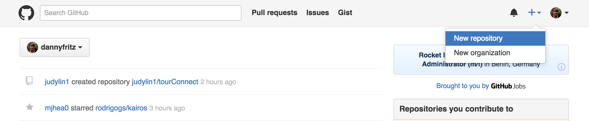
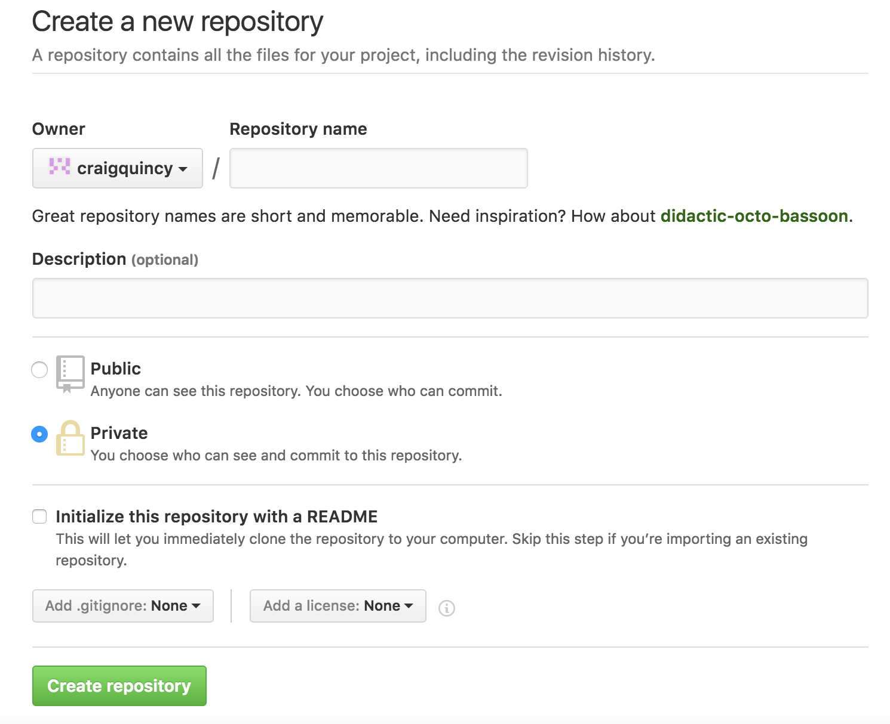

# Track Changes with Git

## Objectives

* Discuss what a Version Control System is
* Describe the purpose of a working directory, staging area, and repository
* Initialize a git repository with `git init`
* Check the status of changed files in a git repository with `git status`
* Stage new and changed files with `git add`
* Commit staged files to the git repository with `git commit`

## Version Control System

Version control is a class of tools that programmers use to manage software projects.
It allows you to track changes you make to files on your machine.
This is helpful for when you screw things up!
And you will. :wink:
And that's ok.
Version control allows developers to revert back to a specific time and place in your code.
Sort of like a reset button.

Version control allows developers to:

  * Keep track of changes to files over time
  * View previous states of your project
  * Return to a previous state of your project
  * Manage changes to files from multiple people
  * Make changes without worrying about stability
  * Keep files together as a group

There are many flavors of VCS:

  * Git
  * Mercurial
  * SVN
  * Perforce
  * TFS
  * etc.

## What is Git?

[Git](https://git-scm.com/) is a free and open source software for version control.
While there are many different version control systems, git is incredibly popular and powerful. Many companies use git, and if you understand git it will be easy to learn another version control paradigm.

Any files tracked by git typically go through 3 stages:

1. Unstaged
  * These changes will not be committed in the next commit
1. Staged
  * These changes will be committed in the next commit
1. Committed
  * Changes committed in the last commit

### What is GitHub?

Git and GitHub are NOT the same thing.
[Github](http://github.com/) is a web based service that hosts repositories on a server and allows developers to easily collaborate.
Github acts as a remote backup service for git repositories.
Once we've __pushed__ to a __remote__ such as GitHub, we know our code is safe.
Even if our hard drives die.
And if GitHub goes down, we can still work on our distributed repos offline.

### A Metaphor: Git is a Rocketship, Github is Mars

:rocket:

A stranded Mars astronaut needs a critical survival package to...well, survive!

| Rocketship  |Git Command/Action | Git Description |
|--------------------|-------------|
| Make a Package        | adding or creating a new file e.g. `touch details.txt` | Unstaged change |
| Package on Launchpad  | `git add details.txt` | Staged change |
| Package in Rocketship | `git commit -m 'including details.txt'` | Commited change |
| Set Coordinates       | `git remote add mars git@github.com:nasa/marooned-astronaut.git` | Remote Respository |
| Launch                | `git push origin master` | Push |

Let's say you want to deliver some packages to Mars with a rocketship. *You want to push changes to GitHub from your git repo*

1. Create some packages. *Make some changes to your files*

1. Choose which packages to place on the launchpad. *`git add` the changed files you want to push*

1. Put the packages on the launchpad into the rocketship. *`git commit`*

  * Any packages left off the launchpad and not in the rocketship will not be sent to Mars. *Any changes not staged with `git add` will not be committed and will not be pushed to GitHub*

1. Repeat the create packages, move to launchpad, and pack rocketship steps for any additional packages you want to send. *Change files, `git add`, `git commit`*

1. Set the rocketship coordinates for Mars. *`git remote add origin git@github.com:nasa/marooned-astronaut.git`*
  * We'll reuse our rocketship, so you only need to do this once per rocket!

1. When the rocketship is sufficiently loaded, we want to launch the rocketship to Mars. *`git push -u origin master`*

1. Astronaut on Mars will recieve your rocketship and be happy with their new packages. *Check your GitHub repo to make sure the changes were pushed*

### Basic Git Commands

There are 4 main commands for `git`
* init
* status
* add
* commit

With these 4 commands you can create a repo and start versioning your project.

#### `git init`

[git manual](https://git-scm.com/docs/git-init)

Initialize a new git repo in the current directory with:
```sh
$ git init
```

You can verify git was intialized by checking if a `.git` folder was created with `ls -a`.

#### `git status`

[git manual](https://git-scm.com/docs/git-status)

When in a git repository, you can type `git status` to see any staged or unstaged changes pending.

In your git repository:
```sh
$ git status
```

Example Output:
```sh
$ git status
On branch g15

Initial commit

Changes to be committed:
  (use "git rm --cached <file>..." to unstage)

	new file:   README.md

Untracked files:
  (use "git add <file>..." to include in what will be committed)

	01_vcs.md
	02_basic_git.md
	03_github.md
	04_github_clone.md
	05_github_workflow.md
```

#### `git add`

[git manual](https://git-scm.com/docs/git-add)

If you have any files that are brand new to the repo or have been changed, you can tell git to start tracking it with:
```sh
$ git add <file>
```

To add all new files and changes in a directory:
```sh
$ git add .
```

After adding a file or change to the repo,
  try running `git status` again to make sure it got staged.

#### `git commit`

[git manual](https://git-scm.com/docs/git-commit)

After staging files with `git add`,
  you can now commit the changes to save the current state of the project as a snapshot in time.

```sh
$ git commit -m "I fixed all of the bugs. :)"
```

This will create a commit in git that will be a snapshot of what the project currently is.

#### `git push`

[git manual](https://git-scm.com/docs/git-push)

If you are using GitHub or collaborating with another git repo, you can push any new commits to your default remote with:
```sh
$ git push
```

If you have your remote pointing to GitHub, you should now be able to see any changes on your GitHub page.

------------------------------------------------------------

> ### Mission Alert!
>
> Welcome aboard the Planet Express ensign! Your first mission is to deliver some important packages to the **Omicron Delegation** who have just landed on the planet **Snarf**.  Planet Snarf is a long way from Austin, but with a little know how we'll be able to make sure our delivery is on-time and on-budget, as always!
>
> As your supervisor, I will help guide you through this mission!

To get setup for this mission you'll need to do the following:

 - Create a new github repository online.  *(click on that green button that says 'New'!)*

 

 - Name your repository, in this case 'planet-snarf' and click 'Create repository'.  This will be the remote location for your files.

  

 - Once you have a remote location created, you'll want to copy it's address.  We'll use this address soon.

 

 - Now open your terminal and navigate to an area where you keep your galvanize stuff, and create a new directory called planet-express-warehouse, then go in to that directory.  

 Enter the following commands:

  `$ mkdir planet-express-warehouse`

  `$ cd planet-express-warehouse`

 - Your prompt (the place in terminal where you type stuff in) might look something like this: `~/planet-express-warehouse $`. Entering the command `pwd` should reveal that you are in the planet-express-warehouse directory.  Go ahead and enter the command `la`.  You should see that the planet-express-warehouse is just an empty directory.  In order to use the Git version control system on this folder and send files from this folder to our remote location, we need to enter this **Git** command:

 `$ git init`

 - If you enter the command `la` again, you'll see a folder named `.git`.  This is where git keeps track of all of your files and the changes you'll make to them, you'll almost never need to mess with that `.git` folder.  Next, let's create the files we want to send over to our remote location (planet-snarf).  *Note: We're using regular terminal commands to make these files, these are not git specific commands.*

 `$ touch mysterious-device.txt`

 `$ touch sketchy-looking-paperwork.txt`

 - Finally, remember that remote address we copied earlier from Github?  We're going to use that now.  We need to tell git in our local folder that we want to be able to send our files to planet-snarf.

 `$ git remote add planet-snarf [Paste or type your remote address here e.g. git@github.com/zubaird/planet-snarf.git]`

 You're now ready to proceed with the mission!

> The planet Snarf receives a lot of deliveries everyday, we need to make sure that we properly label the delivery so that they know what its for.  Additionally, we'll have to specify what things we want included in this delivery from our warehouse.
>
> First off, we need to add a tracking device to each parcel we want to deliver.  Lucky for you, all of the actual work is performed by our robot, Dr.Git!  All you have to do is give it the proper commands.
>

In the world of Git, we add files that we want to track changes on by using `git add`. Type in the ever useful command `git status` to see that you have no files currently tracked, instead it will display a list of files under the heading `'Untracked files:'`.  

> **Step One:** Track the parcels
>
> `git add mysteriousDevice.txt`
>
> `git add sketchyLookingPaperWork.txt`
>

Now when we make changes to these files, Git will keep track of it (down to the last character!).  Open the files up in Atom and add the line 'Planet Express Delivery - [Your Name]'.  Type in the command `git status`, Git will tell you that there are changes made to the files tracked and they are ready to be committed.

> **Step Three:** Load all of the packages on to a crate and label it.
>
> `git commit -m 'stuff for the Omicron Delegation'`
>

Once you commit, enter the command `git status` again and this time you'll see the words `'nothing to commit, working directory clean'`.  Git is saying that no changes have happened since you entered the text 'Planet Express Delivery - [Your Name]' and committed.   If you did make any changes to a file after the commit, you've essentially made a new version of your folder (planet-express-warehouse), and you'll need to make a another commit.  By recording each new change in a commit, we'll have a history that we can look back at, and even be able to switch back to an older version!

> **Step Three:** Load the crate on the Planet Express Ship and Launch to Planet Snarf.
>
> `git push planet-snarf master`   
>

If you enter the command 'git remote -v', Git will list all of the places you can send your files to.  Recall that we set our remote location address earlier and called it `planet-snarf`.  We'll explain what master means later!

------------------------------------------------------------

## Exercises

Try to do these without looking at the answer first!

### Basic Git Workflow

1. Create a new folder
1. Initialize a git repository
1. Create a new file
1. Check that the file is unstaged
1. Add the file to the staging area
1. Check that the file is staged
1. Commit the file

#### Answer

```bash
$ mkdir myProjectName
$ cd myProjectName
$ git init
$ touch readme.md
$ git status
$ git add readme.md
$ git status
$ git commit -m "Initial commit"
```

### Pushing to GitHub

1. Create a GitHub repository and don't initialize it
1. Create a local git repository
1. Create a file
1. Stage the file
1. Commit the file
1. Set the GitHub repo as the git remote
1. Push to GitHub

#### Answer

Create a GitHub repo:




```bash
$ mkdir myProjectName
$ cd myProjectName
$ git init
$ touch readme.md
$ git status
$ git add readme.md
$ git status
$ git commit -m "Initial commit"
$ git remote add origin git@github.com:{userName}/{repoName}.git
$ git push -u origin master
```

## Resources

* [VCS on Wikipedia](https://en.wikipedia.org/wiki/Version_control)
* [Git SCM Manual](https://git-scm.com/book/en/v2/Getting-Started-About-Version-Control)
* [Pro Git book](http://git-scm.com/book/en/v2)
* [Tower Learn Version Control with Git book](https://www.git-tower.com/learn/git/ebook/command-line/introduction#start)
* [Try Git](https://try.github.io/)


## Git Cheatsheet
* [Tower Git Cheatsheet](http://www.git-tower.com/blog/git-cheat-sheet/)
